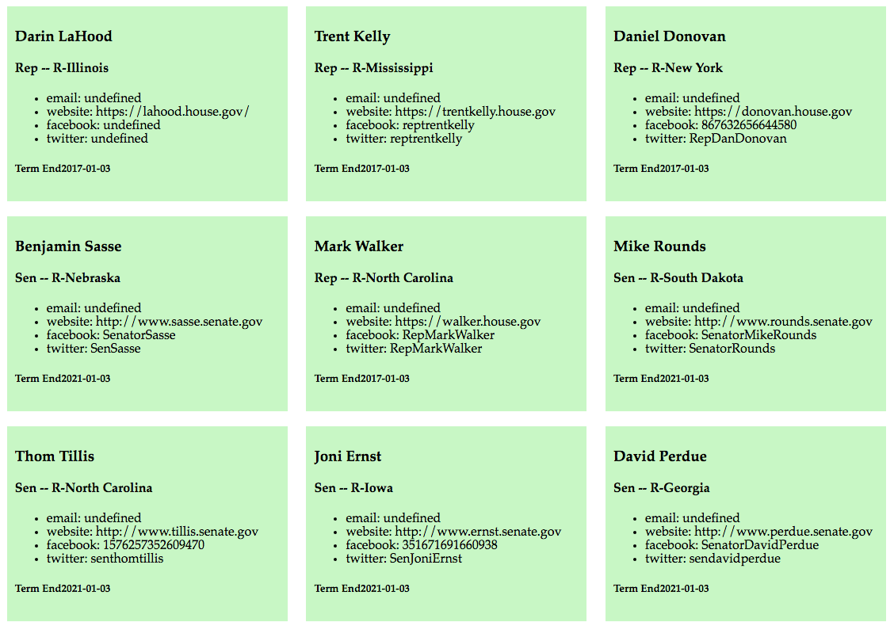
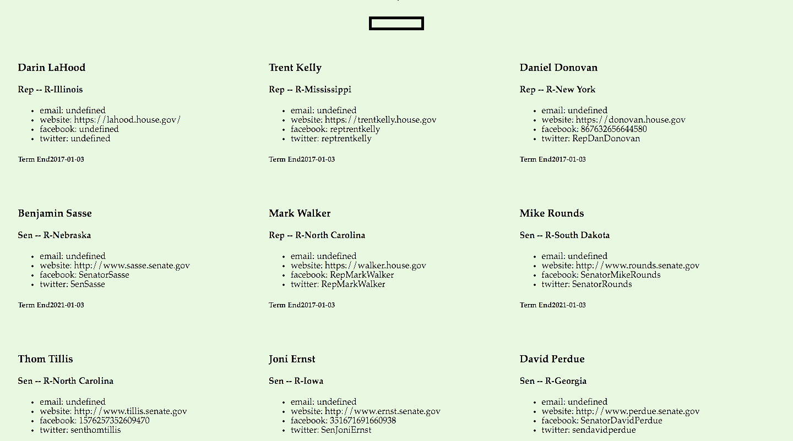

#Intro-APIs

##Objectives

  * Read and explore the documentation of APIs
  * Effectively implement the promise pattern
  * Format retrieved data into HTML

##Setup

* `cd` into your `assignments/` directory
* use the `gen-project-scss` tool to create a new web project
* `cd` into the project
* `git init`
* `hub create`
* include a script tag in your `index.html` that links to the superagent source code (make sure you put it *above* your own `app.js` script!)
* hack away at your `app.js` to create the patterns below!

##Resources

 * Sunlight Foundation API: https://sunlightfoundation.com/api/
 * superagent source code: https://cdnjs.cloudflare.com/ajax/libs/superagent/3.6.0/superagent.min.js

###Normal Mode

Retrieve data on all legislators, reproducing the page shown below:

###Adventure Mode

Include a text input at the top of your page. If the user enters a ZIP code and types enter, your app should retrieve data on local legislators. See gif below:

